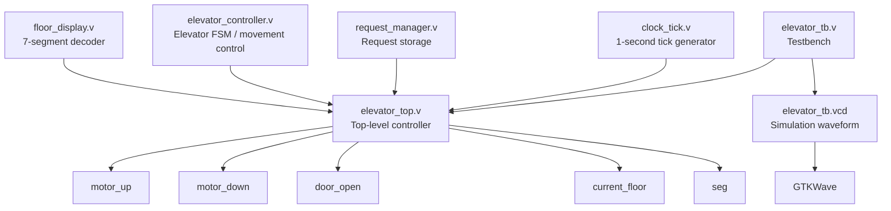
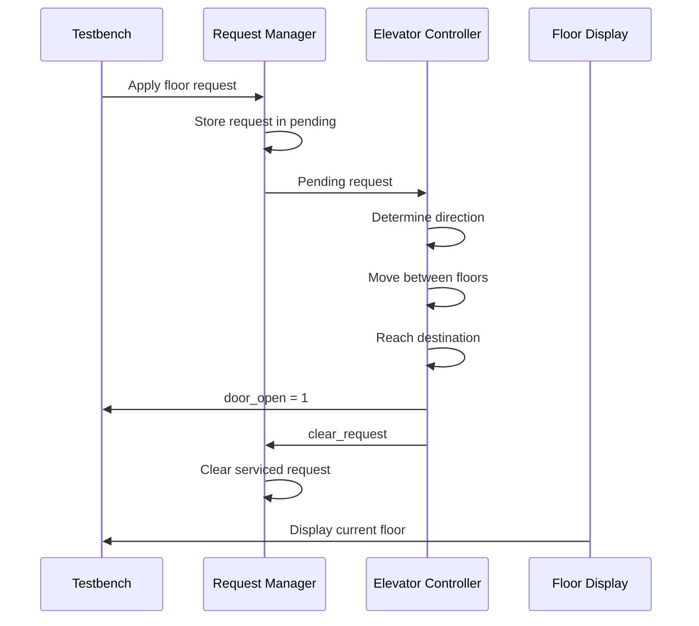
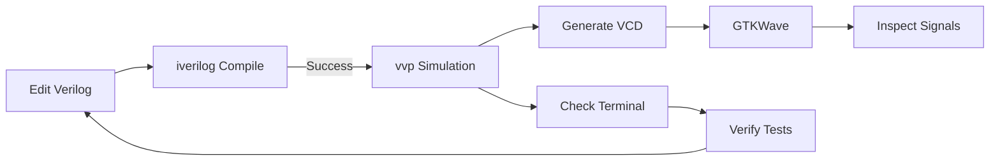

# Lift Controller — Verilog Elevator Project

A learner-level **4-floor elevator controller** designed in Verilog and verified with an Icarus Verilog simulation testbench.

## Project Status

**Simulation verification: PASS**

The testbench successfully verifies:

- Floor 1 → Floor 4
- Floor 4 → Floor 2
- Floor 2 → Floor 1
- Multiple simultaneous requests: Floor 2 + Floor 4
- Up/down motor control
- Door opening at the destination
- Request storage and clearing
- Seven-segment floor display logic
- VCD waveform generation

---

## Project Architecture



## Module Overview

| File | Module | Purpose |
|---|---|---|
| `clock_tick.v` | `clock_tick` | Generates a one-second simulation/control tick from the input clock |
| `request_manager.v` | `request_manager` | Stores floor, up-call, and down-call requests until they are serviced |
| `elevator_controller.v` | `elevator_controller` | Controls elevator movement, destination handling, and door timing |
| `floor_display.v` | `floor_display` | Converts the current floor into a 7-segment display pattern |
| `elevator_top.v` | `elevator_top` | Connects the elevator modules together |
| `elevator_tb.v` | `elevator_tb` | Simulation testbench and automated verification |

## Request Representation

The project uses a 4-bit request vector for the four floors:

```text
Bit 3  → Floor 4
Bit 2  → Floor 3
Bit 1  → Floor 2
Bit 0  → Floor 1
```

Examples:

```text
0001 → Floor 1
0010 → Floor 2
0100 → Floor 3
1000 → Floor 4
1010 → Floor 2 + Floor 4
```

## Simulation Configuration

The testbench uses small parameters so the elevator can be simulated quickly:

```verilog
.CLOCK_FREQ(10),
.FLOOR_TIME(2),
.DOOR_TIME(3)
```

The clock is generated with a 10 ns period:

```verilog
forever #5 clk = ~clk;
```

## Verification Flow



## Verified Test Cases

### Test 1 — Floor 1 → Floor 4

```text
Floor 1
   ↓ UP
Floor 2
   ↓ UP
Floor 3
   ↓ UP
Floor 4
   ↓
Door OPEN
   ↓
Request CLEARED
```

**Result: PASS**

### Test 2 — Floor 4 → Floor 2

```text
Floor 4
   ↓ DOWN
Floor 3
   ↓ DOWN
Floor 2
   ↓
Door OPEN
   ↓
Request CLEARED
```

**Result: PASS**

### Test 3 — Floor 2 → Floor 1

```text
Floor 2
   ↓ DOWN
Floor 1
   ↓
Door OPEN
   ↓
Request CLEARED
```

**Result: PASS**

### Test 4 — Multiple Requests

Two requests are generated together:

```text
1010
 ││
 │└── Floor 2
 └─── Floor 4
```

The controller services them sequentially:

```text
Floor 1
   ↓
Floor 2
   ↓
Door OPEN
   ↓
Floor 2 request cleared
   ↓
Floor 4 request remains pending
   ↓
Floor 3
   ↓
Floor 4
   ↓
Door OPEN
   ↓
Floor 4 request cleared
   ↓
All requests cleared
```

**Result: PASS**

## How to Compile

Open the VS Code terminal in the project directory and run:

```powershell
iverilog -o elevator_sim clock_tick.v request_manager.v elevator_controller.v floor_display.v elevator_top.v elevator_tb.v
```

If there are no errors, run:

```powershell
vvp elevator_sim
```

## How to View Waveforms

The testbench generates:

```text
elevator_tb.vcd
```

Open it with:

```powershell
gtkwave elevator_tb.vcd
```

Useful signals to inspect:

```text
clk
reset
floor_request
up_call
down_call
motor_up
motor_down
door_open
current_floor
seg
DUT.pending
```

## Expected Successful Simulation

The terminal should finish with:

```text
****************************************
*                                      *
*       ALL TESTS PASSED               *
*                                      *
*  TEST 1 : Floor 1 -> Floor 4   PASS *
*  TEST 2 : Floor 4 -> Floor 2   PASS *
*  TEST 3 : Floor 2 -> Floor 1   PASS *
*  TEST 4 : Multiple Requests    PASS *
*                                      *
****************************************
```

## Development Workflow



## Tools

- VS Code
- Icarus Verilog
- GTKWave
- Verilog HDL

## Notes

This is a learning-oriented RTL project. The current simulation configuration uses reduced clock/timing parameters to make simulation practical.

Before FPGA deployment, the clock frequency, timing parameters, pin constraints, reset strategy, and physical I/O interfaces should be adapted to the target FPGA board.

## Current Verification Result

**ALL 4 TESTS PASSED**

The verified multiple-request behavior is:

```text
Floor 1
  │
  ├── Request Floor 2
  └── Request Floor 4
          │
          ▼
      Floor 2
          │
          ▼
      Floor 4
          │
          ▼
    All requests cleared
```
